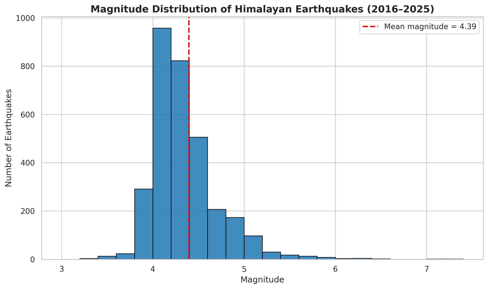
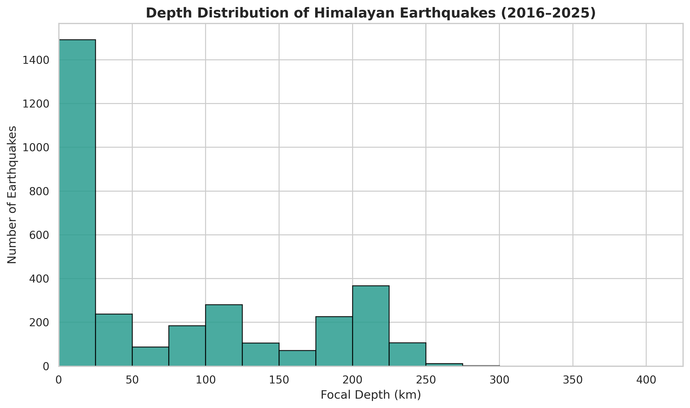
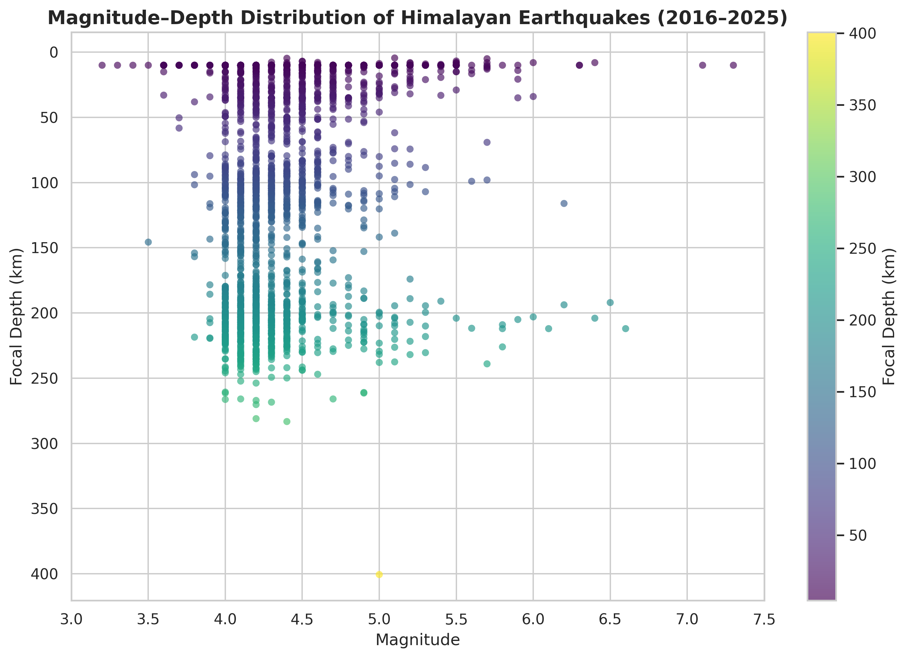
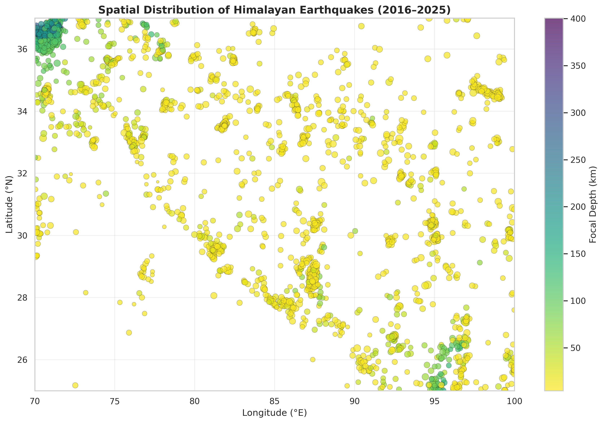
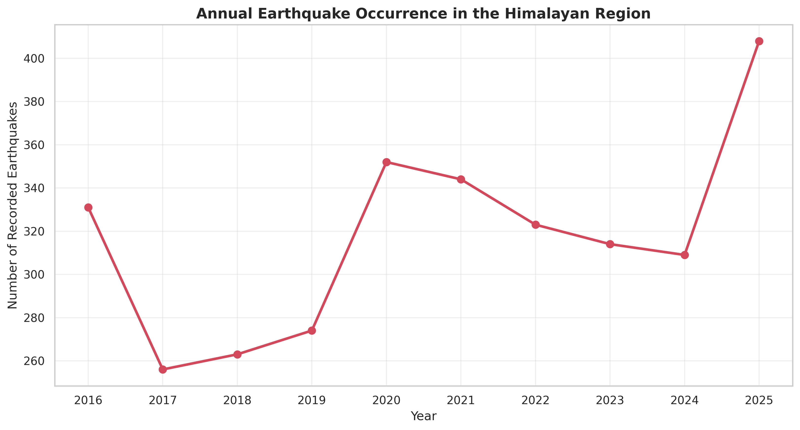
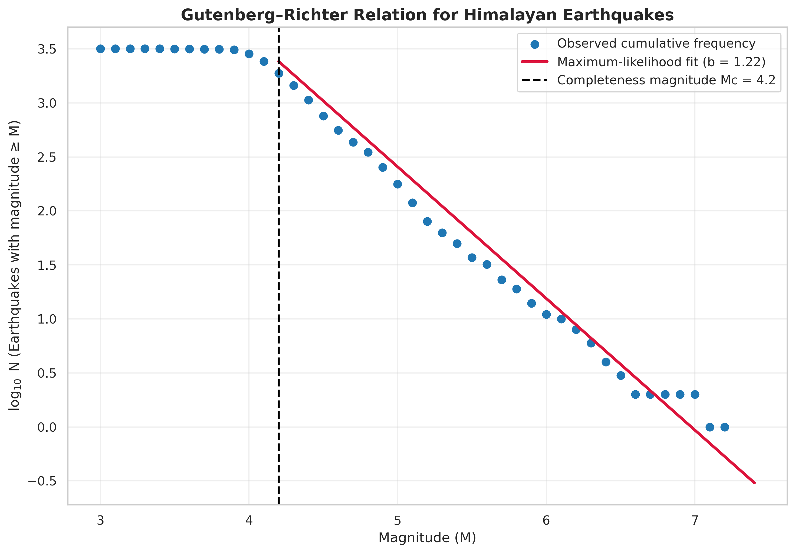

# Himalayan Earthquake Analysis Using Python

A Python-based seismicity analysis of Himalayan-region earthquakes using real USGS earthquake-catalogue data.

## Objective

To analyse the spatial, temporal, depth, and magnitude distribution of earthquakes in the selected Himalayan study region and estimate the Gutenberg–Richter seismicity b-value.

## Dataset

* **Source:** USGS Earthquake Catalog
* **Study period:** 1 January 2016 to 29 December 2025
* **Geographic bounds:** 25–37°N, 70–100°E
* **Minimum magnitude requested:** 3.0
* **Analysed earthquakes:** 3,174

## Tools Used

* Python
* Pandas
* NumPy
* Matplotlib
* Seaborn
* Google Colab

## Methodology

1. Queried earthquake data from the USGS FDSN Event Web Service.
2. Selected essential variables: origin time, latitude, longitude, focal depth, magnitude, magnitude type, and place.
3. Removed incomplete and duplicate records and converted time to datetime format.
4. Analysed magnitude, focal-depth, spatial, and annual seismicity patterns.
5. Calculated the magnitude of completeness using the maximum-curvature method.
6. Estimated the Gutenberg–Richter b-value using a maximum-likelihood approach.

## Key Results

* Magnitudes range from **3.2 to 7.3**, with a mean of **4.39**.
* Focal depths range from **4.44 km to 400.57 km**.
* Most recorded earthquakes are moderate events near magnitude 4.1–4.3.
* Shallow earthquakes are widespread, while deeper-event clustering is visible in the north-western part of the study region.
* The estimated magnitude of completeness is **Mc = 4.2**.
* The Gutenberg–Richter **b-value is 1.22**.

A b-value above 1 indicates that moderate earthquakes are more frequent than larger earthquakes within this selected catalogue. This is a catalogue-level result and should not be interpreted as a local hazard estimate.

## Visualisations

### Magnitude Distribution



### Depth Distribution



### Magnitude–Depth Distribution



### Spatial Distribution



### Annual Earthquake Occurrence



### Gutenberg–Richter Relation



## Repository Structure

```text
himalayan-earthquake-analysis/
├── Earthquake_Data_Analysis.ipynb
├── data/
│   └── himalayan_earthquake_catalogue.csv
├── figures/
│   ├── magnitude_distribution.png
│   ├── depth_distribution.png
│   ├── magnitude_vs_depth.png
│   ├── himalayan_earthquake_map.png
│   ├── annual_earthquake_occurrence.png
│   └── gutenberg_richter_relation.png
├── LICENSE
└── README.md
```

## Data Source

USGS Earthquake Catalog: https://earthquake.usgs.gov/fdsnws/event/1/

## Future Improvements

* Compare seismicity between smaller tectonic sub-regions.
* Analyse temporal changes in b-value.
* Add an interactive map using Folium or Plotly.
* Include waveform-based analysis using ObsPy.

## Author

Aastha Singh
M.Sc. Applied Geophysics, IIT Bombay
